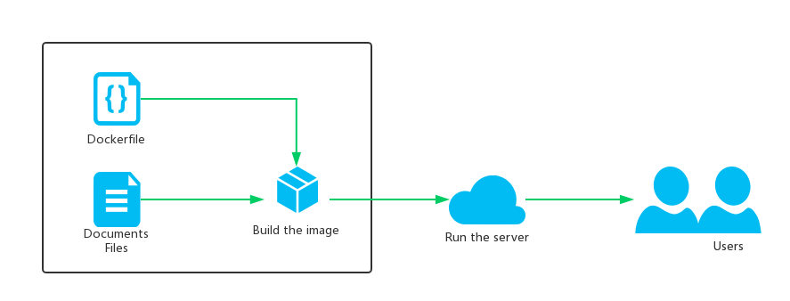

# Docker2Gitbook 
[中文帮助?](#中文说明)

## Intro
Quickly set up the Gitbook Serve online & focus on creating knowledge.
> The purpose of this project is to simplify the construction and online of Gitbook .
> So you need to know some basic knowledge about Gitbook data structure . (Like knowing the function of SUMMARY.md)

## How to use
- You should have installed the `docker`.
- Clone the project from the Github.
```sh
git clone git@github.com:copriwolf/Docker2Gitbook.git
```
- Run the following command to make up a folder named `docs`.
```sh
cd Docker2Gitbook
mkdir docs
```
- Put your documents to the docs(e.g: README.md,SUMMARY.md)
- Run the following command, And wait for the process done.
```sh
docker build . -t 'docker2gitbook'
```
- Run the following command, And you can find the Gitbook Server is online.
```sh
docker run -d -p 4000:4000 docker2gitbook
```

## Project Flow 
- Put the `Document Data` to the folder.
- Build the docker images with `Dockerfile` from the Github.
- Run the Gitbook Server 



---

# 中文说明

## 简介
快速构建gitbook服务容器，让你专注于创作本身。
> 本项目的意图在于把gitbook的构建与上线流程精简化，让用户专注与创作本身，所以你需要先了解Gitbook的数据结构基本知识（使用SUMMARY.md来规范层级关系等）。

## 使用方法
- 使用本项目前要确保已经安装了`docker`.
- 把本项目克隆到本地上
```sh
git clone git@github.com:copriwolf/Docker2Gitbook.git
```
- 进入项目文件夹，并创建一个`docs`子文件夹用于存放文章数据。
```sh
cd Docker2Gitbook
mkdir docs
```
- 把你的文章数据(如README.md,SUMMARY.md)放到子目录`docs`中
- 运行以下命令构建你的Gitbook容器(`build`),并等待构建完成。
```sh
docker build . -t 'docker2gitbook'
```
- 运行以下命令把Gitbook网站开放到本地的4000端口,并后台自动运行服务器
```sh
docker run -d -p 4000:4000 docker2gitbook
```

## 项目流程
- 把`文章数据`放置在子文件夹。
- 通过本项目的`DockerFile`文件构建了一个docker镜像
- 通过运行Docker服务来运行Gitbook服务。


## 注意事项
- 如何查看当前服务器是否在运行中？
在本地运行以下命令，查看是否有回传结果，有即说明服务器在运行中。
```sh
docker ps | grep docker2gitbook
```

- 我不想开放4000端口，我想开放5500端口可以吗？
可以的，docker提供了端口映射功能，我的脚本默认把容器内的4000端口映射到本地的4000端口，如果你需要，可以改为其他的，你可以修改`使用方法的第6步`
```sh
docker run -d -p 5500:4000 docker2gitbook
```


